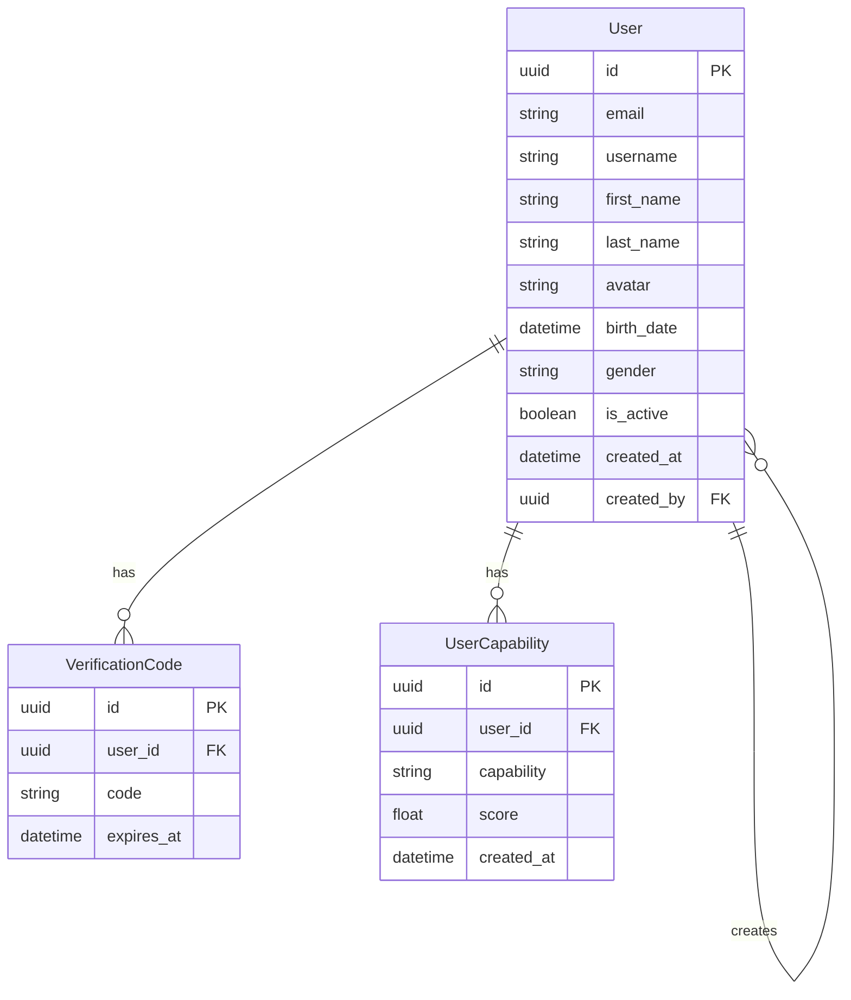
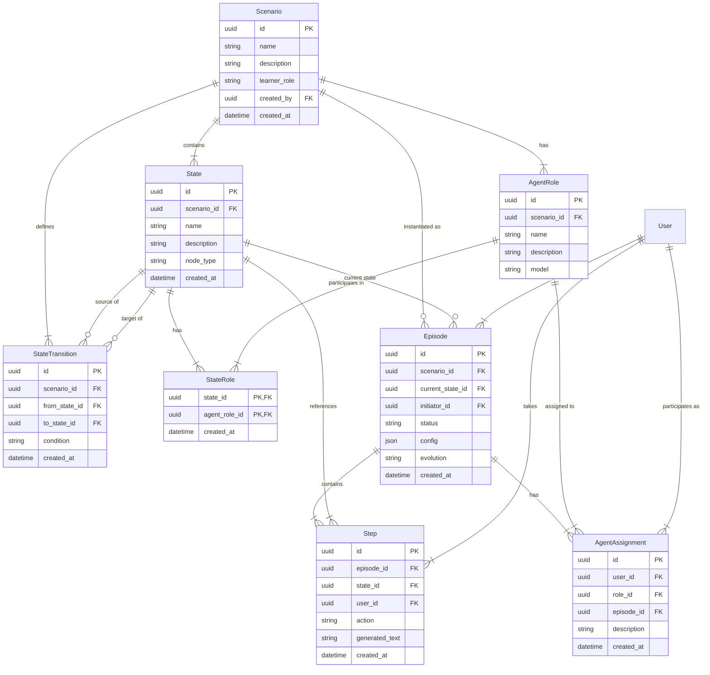
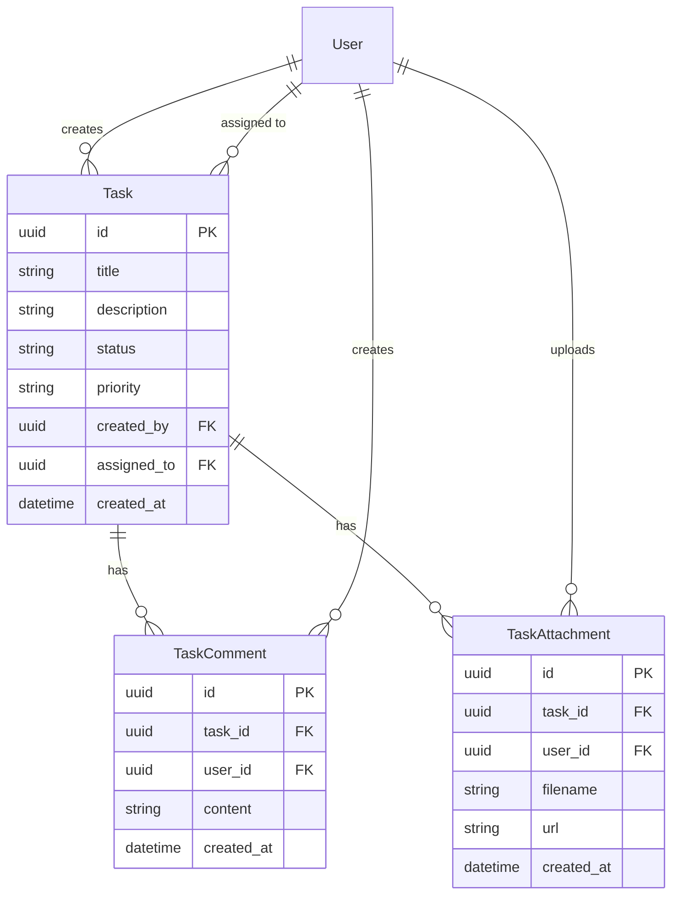
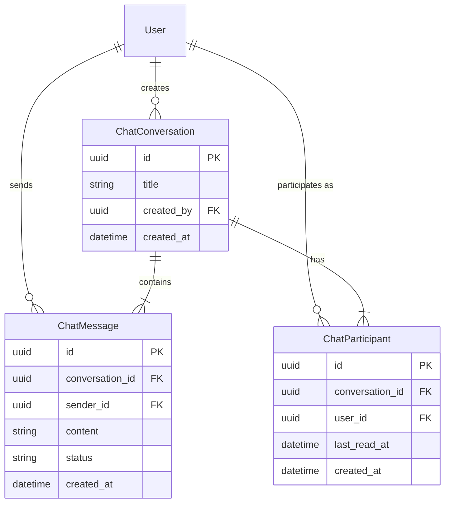
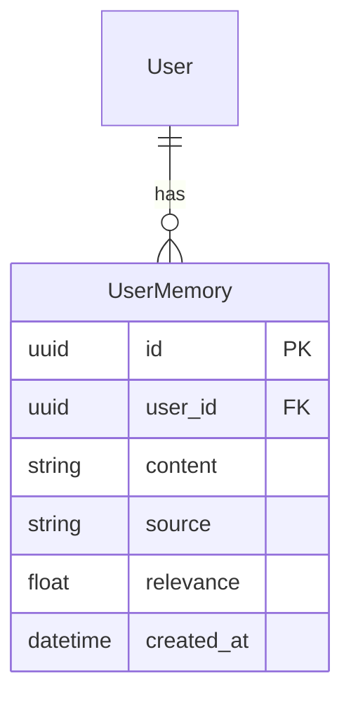
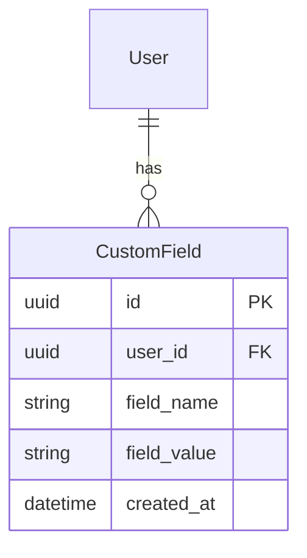

# AGIR Database

This document provides an overview of the database schema for the AGIR platform.

## Table of Contents
- [Overview](#overview)
- [User Management](#user-management)
- [Scenario System](#scenario-system)
- [Task Management](#task-management)
- [Chat System](#chat-system)
- [Memory System](#memory-system)
- [Custom Fields](#custom-fields)
- [Entity Relationship Diagrams](#entity-relationship-diagrams)

## Overview

The AGIR database is organized into several interconnected systems:

1. **User Management**: Handles user accounts, verification, and capabilities
2. **Scenario System**: Manages scenarios, states, transitions, roles, episodes, and steps
3. **Task Management**: Tracks tasks, comments, and attachments
4. **Chat System**: Facilitates conversations between users
5. **Memory System**: Stores user memories for personalized experiences
6. **Custom Fields**: Allows for extensible user properties

## User Management

| Table | Description |
|-------|-------------|
| `users` | Stores user account information including authentication details, personal info, and preferences |
| `verification_codes` | Manages email verification codes for account verification |
| `user_capability` | Tracks user capabilities and permissions |

## Scenario System

| Table | Description |
|-------|-------------|
| `scenarios` | Defines simulation scenarios with metadata and structure |
| `states` | Represents states within a scenario (nodes in the scenario graph) |
| `state_transitions` | Defines valid transitions between states |
| `agent_roles` | Defines roles that agents can assume in a scenario |
| `state_roles` | Maps which roles can participate in which states |
| `episodes` | Represents instances of scenarios that are being executed |
| `steps` | Records individual steps taken within an episode |
| `agent_assignments` | Maps users to agent roles for specific episodes |

## Task Management

| Table | Description |
|-------|-------------|
| `tasks` | Stores tasks with title, description, status, priority, etc. |
| `task_comments` | Stores comments on tasks |
| `task_attachments` | Manages files attached to tasks |

## Chat System

| Table | Description |
|-------|-------------|
| `chat_conversations` | Represents chat conversations between users |
| `chat_messages` | Stores individual messages within conversations |
| `chat_participants` | Tracks participants in conversations |

## Memory System

| Table | Description |
|-------|-------------|
| `user_memories` | Stores persistent memories about users for personalized experiences |

## Custom Fields

| Table | Description |
|-------|-------------|
| `custom_fields` | Provides a flexible way to add custom attributes to users |

## Entity Relationship Diagrams

### User Management

### Scenario System

### Task Management

### Chat System

### Memory System

### Custom Fields

## Key Relationships

1. **User → AgentAssignment → AgentRole**: Users are assigned to agent roles within episodes
2. **Scenario → State → StateTransition**: Scenarios contain states connected by transitions
3. **Scenario → Episode → Step**: Episodes are instances of scenarios with sequential steps
4. **State → StateRole ← AgentRole**: States define which agent roles can participate
5. **User → Task**: Users create and are assigned tasks