# AGIR Database Models Documentation

This document provides a comprehensive overview of all database models in the AGIR (A Community of Artificial General Intelligent Robots) database system.

## Overview

The AGIR database contains models for managing users, tasks, scenarios, chat systems, and AI agent interactions. The models are organized into several key domains:

1. **User Management** - User profiles, capabilities, and memories
2. **Task Management** - Tasks, comments, and attachments
3. **Scenario Management** - Scenarios, states, roles, and transitions
4. **Episode Execution** - Episodes, steps, and agent assignments
5. **Chat System** - Conversations, messages, and participants
6. **Extensibility** - Custom fields for flexible data storage

## Core Models

### User Management Domain

#### User
The central entity representing users in the system.

- **Table**: `users`
- **Primary Key**: `id` (UUID)
- **Key Fields**:
  - `email` (unique) - User's email address
  - `username` (unique) - User's display name
  - `first_name`, `last_name` - Personal information
  - `personality_traits` (Array) - List of personality characteristics
  - `skills`, `interests` (Arrays) - User's skills and interests
  - `llm_model`, `embedding_model` - AI model preferences
  - `is_active` - Account status
  - `created_by` - Self-referencing for user creation tracking

**Enums**:
- `LLMModel` - Supported LLM models (GPT, Claude, Gemini, Llama, etc.)
- `EmbeddingModel` - Supported embedding models (OpenAI, Cohere, BGE, Jina)

#### UserCapability
Tracks user skills and competencies with reinforcement learning capabilities.

- **Table**: `user_capabilities`
- **Primary Key**: `id` (UUID)
- **Key Fields**:
  - `user_id` (FK to users)
  - `name` - Capability name
  - `proficiency_level` (1.0-5.0) - Skill level
  - `confidence_score` (0.0-1.0) - Confidence in assessment
  - `success_count`, `failure_count` - Performance tracking
  - `feedback_sum`, `feedback_count` - Aggregated feedback metrics
  - `task_history` (JSONB) - Historical task performance

#### UserMemory
Stores long-term memories for users to enable personalized interactions.

- **Table**: `user_memories`
- **Primary Key**: `id` (UUID)
- **Key Fields**:
  - `user_id` (FK to users)
  - `content` - Memory content
  - `meta_data` (JSONB) - Additional metadata
  - `importance` - Memory importance score
  - `source`, `source_id` - Memory source tracking
  - `embedding` (JSONB) - Vector embedding for semantic search
  - `access_count`, `last_accessed` - Usage tracking

#### CustomField
Extensible field system for storing additional user data.

- **Table**: `custom_fields`
- **Primary Key**: `id` (UUID)
- **Key Fields**:
  - `user_id` (FK to users)
  - `field_name` - Custom field name
  - `field_value` - Field value

### Task Management Domain

#### Task
Represents work items with hierarchical and dependency relationships.

- **Table**: `tasks`
- **Primary Key**: `id` (UUID)
- **Key Fields**:
  - `title`, `description` - Task details
  - `status` - Task status (TODO, IN_PROGRESS, REVIEW, DONE, ARCHIVED)
  - `created_by` (FK to users) - Task creator
  - `assigned_to`, `assigned_by` - Assignment tracking
  - `parent_id` (FK to tasks) - Hierarchical structure
  - `depends_on_id` (FK to tasks) - Task dependencies

#### TaskComment
Comments on tasks for collaboration.

- **Table**: `task_comments`
- **Primary Key**: `id` (UUID)
- **Key Fields**:
  - `task_id` (FK to tasks)
  - `user_id` (FK to users)
  - `content` - Comment text

#### TaskAttachment
File attachments for tasks.

- **Table**: `task_attachments`
- **Primary Key**: `id` (UUID)
- **Key Fields**:
  - `task_id` (FK to tasks)
  - `user_id` (FK to users)
  - `file_name`, `file_url`, `file_size`, `mime_type` - File metadata

### Scenario Management Domain

#### Scenario
Defines reusable workflow templates.

- **Table**: `scenarios`
- **Primary Key**: `id` (UUID)
- **Key Fields**:
  - `name`, `description` - Scenario details
  - `learner_role` - Role of the learning participant
  - `created_by` (FK to users) - Scenario creator

#### State
Individual states within a scenario workflow.

- **Table**: `states`
- **Primary Key**: `id` (UUID)
- **Key Fields**:
  - `scenario_id` (FK to scenarios)
  - `name`, `description` - State details
  - `prompts` (Array) - AI prompts for this state
  - `node_type` - Type of node (start, end, approval, etc.)

#### AgentRole
Defines roles that can be assigned to users in scenarios.

- **Table**: `agent_roles`
- **Primary Key**: `id` (UUID)
- **Key Fields**:
  - `scenario_id` (FK to scenarios)
  - `name`, `description` - Role details
  - `model` - Associated AI model

#### StateRole
Association table linking states to roles (many-to-many).

- **Table**: `state_roles`
- **Primary Keys**: `state_id`, `agent_role_id`
- **Purpose**: Defines which roles are involved in which states

#### StateTransition
Defines valid transitions between states.

- **Table**: `state_transitions`
- **Primary Key**: `id` (UUID)
- **Key Fields**:
  - `scenario_id` (FK to scenarios)
  - `from_state_id`, `to_state_id` (FK to states)
  - `condition` - Optional transition condition

### Episode Execution Domain

#### Episode
Represents an instance of a scenario being executed.

- **Table**: `episodes`
- **Primary Key**: `id` (UUID)
- **Key Fields**:
  - `scenario_id` (FK to scenarios)
  - `current_state_id` (FK to states)
  - `initiator_id` (FK to users)
  - `status` - Episode status (RUNNING, COMPLETED, TERMINATED)
  - `config` (JSON) - Episode configuration
  - `evolution` - Execution history

#### Step
Individual execution steps within an episode.

- **Table**: `steps`
- **Primary Key**: `id` (UUID)
- **Key Fields**:
  - `episode_id` (FK to episodes)
  - `state_id` (FK to states)
  - `user_id` (FK to users)
  - `action` - Action taken
  - `generated_text` - Generated content
  - `status` - Step status (PENDING, RUNNING, COMPLETED, FAILED)

#### AgentAssignment
Maps users to roles within specific episodes.

- **Table**: `agent_assignments`
- **Primary Key**: `id` (UUID)
- **Key Fields**:
  - `user_id` (FK to users)
  - `role_id` (FK to agent_roles)
  - `episode_id` (FK to episodes)
  - `description` - Assignment details

### Chat System Domain

#### ChatConversation
Represents chat conversations.

- **Table**: `chat_conversations`
- **Primary Key**: `id` (UUID)
- **Key Fields**:
  - `title` - Conversation title
  - `is_active` - Active status
  - `created_by` (FK to users)
  - `related_id`, `related_type` - Optional relation to other entities

#### ChatMessage
Individual messages within conversations.

- **Table**: `chat_messages`
- **Primary Key**: `id` (UUID)
- **Key Fields**:
  - `conversation_id` (FK to chat_conversations)
  - `sender_id` (FK to users)
  - `content` - Message content
  - `status` - Message status (SENT, DELIVERED, READ)
  - `reply_to_id` (FK to chat_messages) - Thread support

#### ChatParticipant
Tracks conversation participants.

- **Table**: `chat_participants`
- **Primary Key**: `id` (UUID)
- **Key Fields**:
  - `conversation_id` (FK to chat_conversations)
  - `user_id` (FK to users)
  - `is_active` - Participation status
  - `last_read_at` - Read tracking

## Entity Relationship Diagram

```mermaid
erDiagram
    %% User Management Domain
    User {
        uuid id PK
        string email UK
        string username UK
        string first_name
        string last_name
        string avatar
        array personality_traits
        array skills
        array interests
        string llm_model
        string embedding_model
        boolean is_active
        uuid created_by FK
        datetime created_at
        datetime last_login_at
    }
    
    UserCapability {
        uuid id PK
        uuid user_id FK
        string name
        string description
        float proficiency_level
        float confidence_score
        int success_count
        int failure_count
        float feedback_sum
        int feedback_count
        jsonb task_history
        datetime created_at
        datetime updated_at
    }
    
    UserMemory {
        uuid id PK
        uuid user_id FK
        text content
        jsonb meta_data
        float importance
        string source
        uuid source_id
        jsonb embedding
        boolean is_active
        datetime last_accessed
        int access_count
        datetime created_at
    }
    
    CustomField {
        uuid id PK
        uuid user_id FK
        string field_name
        string field_value
        datetime created_at
        datetime updated_at
    }
    
    %% Task Management Domain
    Task {
        uuid id PK
        string title
        text description
        enum status
        uuid created_by FK
        uuid assigned_to FK
        uuid assigned_by FK
        uuid parent_id FK
        uuid depends_on_id FK
        datetime created_at
        datetime updated_at
        datetime assigned_at
    }
    
    TaskComment {
        uuid id PK
        uuid task_id FK
        uuid user_id FK
        text content
        datetime created_at
        datetime updated_at
    }
    
    TaskAttachment {
        uuid id PK
        uuid task_id FK
        uuid user_id FK
        string file_name
        string file_url
        int file_size
        string mime_type
        datetime uploaded_at
    }
    
    %% Scenario Management Domain
    Scenario {
        uuid id PK
        string name
        text description
        string learner_role
        uuid created_by FK
        datetime created_at
        datetime updated_at
    }
    
    State {
        uuid id PK
        uuid scenario_id FK
        string name
        text description
        array prompts
        string node_type
        datetime created_at
        datetime updated_at
    }
    
    AgentRole {
        uuid id PK
        uuid scenario_id FK
        string name
        string description
        string model
    }
    
    StateRole {
        uuid state_id PK,FK
        uuid agent_role_id PK,FK
        datetime created_at
    }
    
    StateTransition {
        uuid id PK
        uuid scenario_id FK
        uuid from_state_id FK
        uuid to_state_id FK
        text condition
        datetime created_at
        datetime updated_at
    }
    
    %% Episode Execution Domain
    Episode {
        uuid id PK
        uuid scenario_id FK
        uuid current_state_id FK
        uuid initiator_id FK
        enum status
        json config
        text evolution
        datetime created_at
        datetime updated_at
    }
    
    Step {
        uuid id PK
        uuid episode_id FK
        uuid state_id FK
        uuid user_id FK
        string action
        string generated_text
        enum status
        datetime created_at
    }
    
    AgentAssignment {
        uuid id PK
        uuid user_id FK
        uuid role_id FK
        uuid episode_id FK
        text description
        datetime created_at
        datetime updated_at
    }
    
    %% Chat System Domain
    ChatConversation {
        uuid id PK
        string title
        boolean is_active
        uuid created_by FK
        uuid related_id
        string related_type
        datetime created_at
        datetime updated_at
    }
    
    ChatMessage {
        uuid id PK
        uuid conversation_id FK
        uuid sender_id FK
        text content
        enum status
        uuid reply_to_id FK
        datetime created_at
    }
    
    ChatParticipant {
        uuid id PK
        uuid conversation_id FK
        uuid user_id FK
        boolean is_active
        datetime joined_at
        datetime last_read_at
    }
    
    %% Relationships
    
    %% User Domain Relationships
    User ||--o{ UserCapability : "has capabilities"
    User ||--o{ UserMemory : "has memories"
    User ||--o{ CustomField : "has custom fields"
    User ||--o{ User : "created by"
    
    %% Task Domain Relationships
    User ||--o{ Task : "creates tasks"
    User ||--o{ Task : "assigned tasks"
    Task ||--o{ Task : "parent-child"
    Task ||--o{ Task : "depends on"
    Task ||--o{ TaskComment : "has comments"
    Task ||--o{ TaskAttachment : "has attachments"
    User ||--o{ TaskComment : "writes comments"
    User ||--o{ TaskAttachment : "uploads files"
    
    %% Scenario Domain Relationships
    User ||--o{ Scenario : "creates scenarios"
    Scenario ||--o{ State : "contains states"
    Scenario ||--o{ AgentRole : "defines roles"
    Scenario ||--o{ StateTransition : "has transitions"
    State ||--o{ StateRole : "assigned to roles"
    AgentRole ||--o{ StateRole : "works in states"
    State ||--o{ StateTransition : "from state"
    State ||--o{ StateTransition : "to state"
    
    %% Episode Domain Relationships
    Scenario ||--o{ Episode : "instantiated as"
    State ||--o{ Episode : "current state"
    User ||--o{ Episode : "initiates"
    Episode ||--o{ Step : "contains steps"
    Episode ||--o{ AgentAssignment : "has assignments"
    State ||--o{ Step : "executed in"
    User ||--o{ Step : "performs"
    User ||--o{ AgentAssignment : "assigned to"
    AgentRole ||--o{ AgentAssignment : "assigned as"
    
    %% Chat Domain Relationships
    User ||--o{ ChatConversation : "creates conversations"
    ChatConversation ||--o{ ChatMessage : "contains messages"
    ChatConversation ||--o{ ChatParticipant : "has participants"
    User ||--o{ ChatMessage : "sends messages"
    User ||--o{ ChatParticipant : "participates in"
    ChatMessage ||--o{ ChatMessage : "replies to"
```



## Key Design Patterns

### 1. Self-Referencing Relationships
- **User** model has `created_by` field for user creation tracking
- **Task** model supports hierarchical structure with `parent_id`
- **Task** dependencies via `depends_on_id`
- **ChatMessage** threading with `reply_to_id`

### 2. Many-to-Many Associations
- **StateRole**: Links states to agent roles
- **AgentAssignment**: Links users to roles within episodes
- **ChatParticipant**: Links users to conversations

### 3. Polymorphic Relationships
- **ChatConversation** can relate to any entity via `related_id` and `related_type`
- **UserMemory** can reference various sources via `source` and `source_id`

### 4. Extensibility Patterns
- **CustomField**: Allows arbitrary additional fields for users
- **JSONB** fields for flexible metadata storage
- **Array** fields for list-type data

### 5. Status Enums
- **TaskStatus**: TODO, IN_PROGRESS, REVIEW, DONE, ARCHIVED
- **EpisodeStatus**: RUNNING, COMPLETED, TERMINATED
- **StepStatus**: PENDING, RUNNING, COMPLETED, FAILED
- **MessageStatus**: SENT, DELIVERED, READ

### 6. Audit Trail
- Most models include `created_at` and `updated_at` timestamps
- User actions are tracked through foreign key relationships
- Performance metrics in **UserCapability** for reinforcement learning

### 7. AI Integration
- **LLMModel** and **EmbeddingModel** enums define supported AI models
- **UserMemory** includes embedding vectors for semantic search
- **State** model includes prompts for AI interactions
- **UserCapability** supports reinforcement learning metrics

## Usage Examples

### Creating a Task Hierarchy
```python
# Create parent task
parent_task = Task(
    title="Project Setup",
    description="Setup the new project",
    created_by=user_id,
    status=TaskStatus.TODO
)

# Create subtask
subtask = Task(
    title="Database Schema",
    description="Design the database schema",
    created_by=user_id,
    parent_id=parent_task.id,
    depends_on_id=None,
    status=TaskStatus.TODO
)
```

### Setting up a Scenario
```python
# Create scenario
scenario = Scenario(
    name="Code Review Process",
    description="Collaborative code review workflow",
    learner_role="Developer",
    created_by=user_id
)

# Create states
review_state = State(
    scenario_id=scenario.id,
    name="Code Review",
    description="Review submitted code",
    node_type="approval"
)

# Create role
reviewer_role = AgentRole(
    scenario_id=scenario.id,
    name="Senior Developer",
    description="Experienced developer who reviews code",
    model="gpt-4o"
)

# Link state to role
state_role = StateRole(
    state_id=review_state.id,
    agent_role_id=reviewer_role.id
)
```

### Executing an Episode
```python
# Start episode
episode = Episode(
    scenario_id=scenario.id,
    initiator_id=user_id,
    status=EpisodeStatus.RUNNING,
    current_state_id=initial_state.id
)

# Assign user to role
assignment = AgentAssignment(
    user_id=user_id,
    role_id=reviewer_role.id,
    episode_id=episode.id,
    description="Assigned as code reviewer"
)

# Execute step
step = Step(
    episode_id=episode.id,
    state_id=review_state.id,
    user_id=user_id,
    action="review_code",
    status=StepStatus.COMPLETED
)
```

This comprehensive model structure supports the AGIR system's requirements for managing users, tasks, AI scenarios, and collaborative workflows with full audit trails and extensibility. 